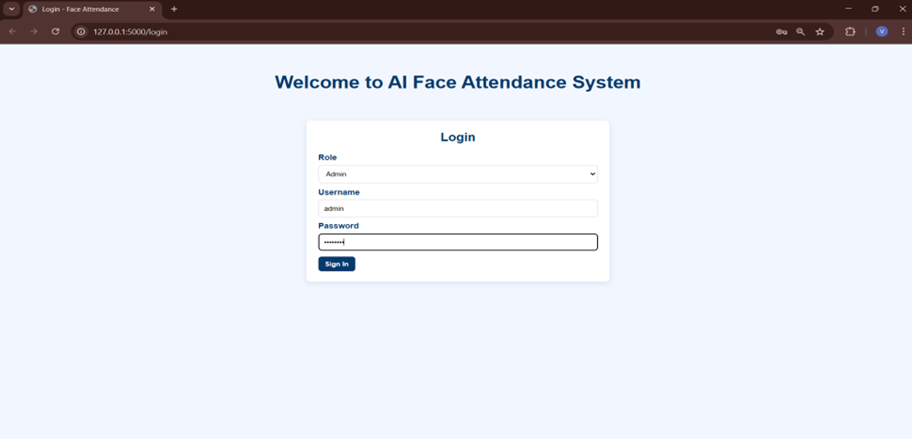
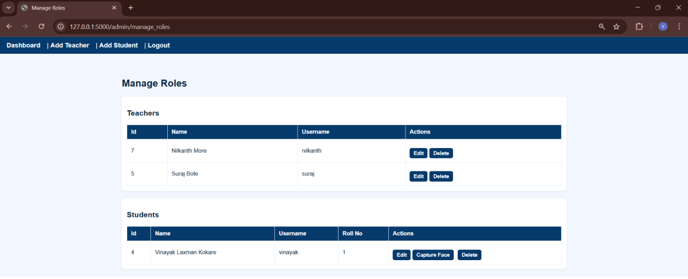
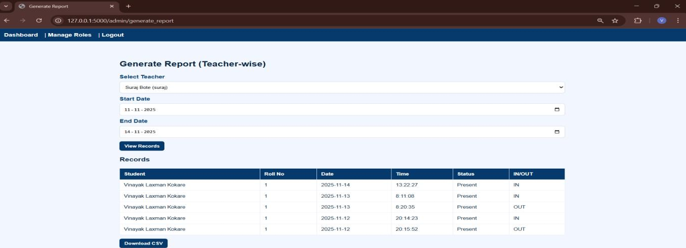
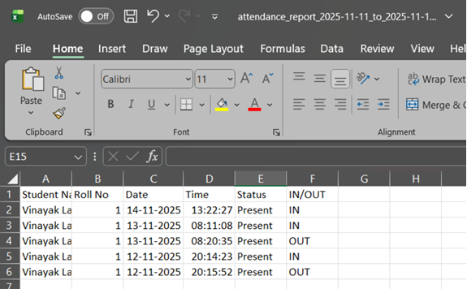
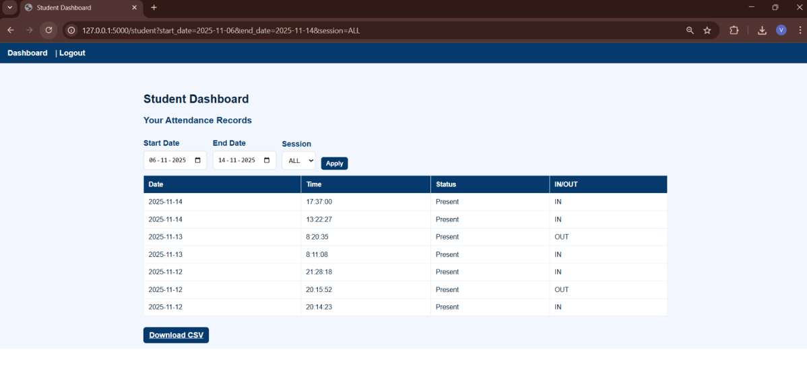

AI Face Recognition Attendance System

An AI-powered attendance management system developed using Python, Flask, OpenCV, and MySQL that automates attendance tracking through real-time face recognition.

---

Project Overview

Traditional attendance systems are time-consuming and vulnerable to proxy attendance. This project provides an automated and intelligent solution using AI-based face recognition to accurately identify students and mark attendance in real time.

The system supports separate dashboards for Admin, Teacher, and Student users with secure role-based access and attendance tracking.

---

Features

Admin Module

- Add/Edit/Delete Teachers
- Add/Edit/Delete Students
- Capture Student Face Dataset
- View Attendance Reports
- Download Attendance CSV Reports
- Manage Roles and Access

Teacher Module

- Start Attendance Session (IN/OUT)
- Real-Time Face Detection
- Automatic Attendance Marking
- Filter Attendance Records
- Download Attendance Reports

Student Module

- View Personal Attendance
- Filter Attendance Records
- Download Attendance CSV

AI Face Recognition

- Real-Time Face Recognition
- Face Encoding & Matching
- Proxy Attendance Prevention
- Automatic Attendance Logging

---

Technologies Used

- Python
- Flask
- OpenCV
- Face Recognition Library (dlib CNN Model)
- MySQL
- HTML
- CSS
- PyMySQL
- NumPy

---

System Modules

- Authentication Module
- Admin Dashboard
- Teacher Dashboard
- Student Dashboard
- Face Recognition Module
- Attendance Management Module
- Database Module

---

Project Structure

```text
AI-Face-Recognition-Attendance-System/
│
├── dataset/
├── Screenshots/
├── static/
├── templates/
│
├── app.py
├── db_schema.sql
├── requirements.txt
├── README.md
└── .gitignore
```

---

Installation

1. Clone the repository

```bash
git clone https://github.com/vinayakkokare/AI-Face-Recognition-Attendance-System.git
```

2. Open project folder

```bash
cd AI-Face-Recognition-Attendance-System
```

3. Create virtual environment

```bash
python -m venv venv
```

4. Activate virtual environment

Windows

```bash
venv\Scripts\activate
```

Linux/Mac

```bash
source venv/bin/activate
```

5. Install dependencies

```bash
pip install -r requirements.txt
```

6. Configure MySQL database

- Create database
- Import `db_schema.sql`
- Update database credentials in project files

7. Run the application

```bash
python app.py
```

---

Important Setup Notes

- Configure MySQL database before running project
- Import `db_schema.sql`
- Update database credentials in project files
- Create admin account manually if required
- Capture student face datasets before attendance recognition

---

How It Works

1. Admin adds students and captures face dataset
2. Face encodings are generated using AI models
3. Teacher starts attendance session
4. System detects and recognizes student faces
5. Attendance is automatically marked with:
   - Student ID
   - Date
   - Time
   - IN/OUT status
6. Records are stored in MySQL database

---

Screenshots

Login Page



Admin Dashboard


Admin Managing Roles



Attendance Capturing


Download Attendance



Downloaded Attendance Excel



Student Dashboard



---

Advantages

- Eliminates Proxy Attendance
- Real-Time Attendance Tracking
- Secure Role-Based Access
- Automated Attendance Management
- CSV Report Generation
- Accurate Digital Records

---

Future Improvements

- Cloud Deployment
- Mobile Application
- Email/SMS Notifications
- Advanced Analytics Dashboard
- Multi-Camera Support

---

Author

Vinayak Kokare  
